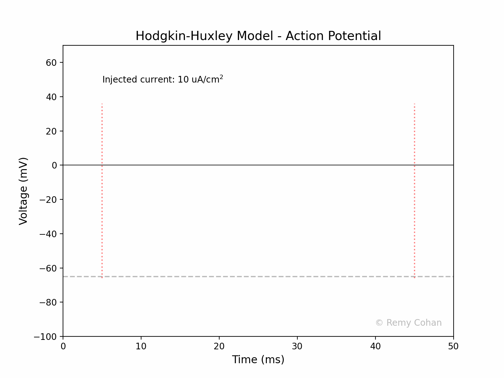

nstrate and simulate The Hodgkin-Huxley model for a group of students.You can use any IDE to run the code, but I recommend Jupyter Lab. Make sure you install the dependencies. Remy Cohan, July 2023.

# Hodgkin-Huxley Model - Action Potential README
I wrote this script to demonstrate and simulate The Hodgkin-Huxley model for a group of students.You can use any IDE to run the code, but I recommend Jupyter Lab. Make sure you install the dependencies. Remy Cohan, July 2023.

## Introduction
The Hodgkin-Huxley Model describes how action potentials in neurons are initiated and propagated. Developed by Alan Hodgkin and Andrew Huxley in 1952 based on their experiments on the giant axon of the squid, this model describes the electrical characteristics of the cell membrane and won them the Nobel Prize in Physiology or Medicine in 1963.

### Neurophysiology of Hodgkin-Huxley

#### 1. **Action Potentials**:
An action potential is a rapid rise and subsequent fall in voltage or membrane potential across a cellular membrane. It's a fundamental signal in the nervous system, enabling the transmission of information over long distances.

#### 2. **Ionic Basis**:
The variation in membrane potential during an action potential arises due to selective ion currents through voltage-gated ion channels. The key ions involved are sodium (Na+), potassium (K+), and leak ions.

#### 3. **Gating Variables**:
The voltage-gated ion channels can open or close in response to the voltage across the membrane. This behavior is represented by gating variables (`n`, `m`, and `h`), which describe the probability of a channel being open.

- `n`: Gating variable for potassium channels.
- `m`: Gating variable for sodium activation.
- `h`: Gating variable for sodium inactivation.

## Code Explanation

### Libraries and Dependencies

1. `numpy`: For mathematical operations and handling arrays.
2. `matplotlib.pyplot`: For plotting the results.
3. `matplotlib.animation`: For creating animated plots.
4. `scipy.integrate`: To solve the differential equations of the model.

### Constants:

- **`Cm`**: Membrane capacitance. Determines how the membrane potential responds to the currents.
- **`g_Na, g_K, g_L`**: Maximum conductances for sodium, potassium, and leak channels, respectively.
- **`E_Na, E_K, E_L`**: Reversal potentials for sodium, potassium, and leak channels. These determine the direction and magnitude of ion flow.

### Gating Variable Functions:

These functions (`alpha` and `beta` for each `n`, `m`, and `h`) represent the voltage-dependent transition rates between the open and closed states of the ion channels.

### Hodgkin-Huxley Model:

The function `hodgkin_huxley` encapsulates the differential equations that describe the model. These equations are derived from the currents through the ion channels and the voltage across the membrane.

### Simulation:

1. **Initial conditions**: The initial values for membrane potential and the gating variables are set.
2. **Time vector**: Defines the simulation time.
3. **ODE Solution**: Using `odeint` from SciPy, the system of differential equations is solved over the defined time.
4. **Plotting and Animation**: The solution, representing the membrane potential over time, is plotted and animated to visualize the action potential.

### Output:

The code creates an animated GIF representing the action potential as a function of time, visualizing the effect of the injected current on the membrane potential.

© Remy Cohan 2023

---

Save this content as `README.md` in the same directory as your Python script to provide a detailed overview of the Hodgkin-Huxley Model and a comprehensive explanation of your code.
